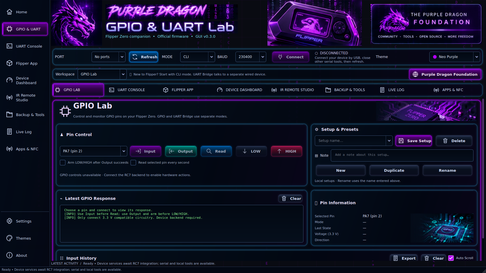

# PurpleDragonFlipperStudio

Neon GUI v0.3.0 · Created by KyleAustinHillier @PurpleDragonFoundationLtd

Rebuilt around your supplied neon-console design: the illustrated brush-style header, dragon and Flipper artwork, compact connection bar, sidebar and horizontal workspace tabs, purple outer frame, blue inner frames, multicolor illuminated GPIO buttons, and two-column GPIO layout. This is a runnable Qt desktop interface with real controls and live Matrix rain.



## Run on Windows 11

1. Extract this ZIP into a **new folder**.
2. Double-click **Setup.bat**. It supports standard 64-bit CPython **3.10–3.14**, selects a compatible installation, and downloads the pinned dependencies.
3. Double-click **Start.bat**.

If Python is absent, install it from https://www.python.org/downloads/windows/ and enable the Python launcher. Use the standard build, rather than the free-threaded build. Setup preserves an incompatible `.venv` folder before rebuilding. **Debug-Launch.bat** displays launch errors. No administrator rights are needed.

This release reuses your saved user settings. On first use, it applies the stronger Matrix brightness/speed defaults for the new design. Theme, reduced motion, and other preferences remain available in **Themes**.

## Visual design

- Home opens the GPIO workspace from the reference.
- Eight workspace tabs and the sidebar follow the selected page.
- The compact connection bar includes a live theme selector with color swatches.
- Custom painted buttons have colored light bloom, inset gradients, line icons and keyboard focus feedback.
- Panels have layered neon edges and dark glass surfaces.
- GPIO controls use purple, cyan, blue, slate and red accents.
- The title, dragon, device and chip artwork are rendered from the supplied reference as decorative assets. The application is not a screenshot with click targets: its controls, layouts, console, forms and animation are implemented in Qt.
- Matrix rain moves behind the interface, pauses while minimized, and supports brightness, speed and reduced-motion settings.
- Compact screens stack the GPIO panels and wrap the tab row. The full header artwork appears when there is enough width.

## Working features

| Area | Available now |
| --- | --- |
| Serial | USB serial-port discovery, open/close, bounded text receive, explicit text send with selectable line endings |
| GPIO setups | Named local experiments, pin choice, notes, save/delete, JSON import/export |
| GPIO workspace | Reference-based controls, pin information, response area and exportable history pane |
| Appearance | Eight themes, inline theme switching, glow, Matrix controls, persistent settings |
| Local IR | Open and preview `.ir` files |
| Local tools | Console, setup and session-log exports |
| Navigation | Last-workspace restore, synchronized selectors, keyboard shortcuts, session Back/Forward history |
| Apps | Official catalog, NFC category, community directory and Foundation website |

Hardware GPIO reads/writes, IR transmission, SD backup, app installation and device telemetry still need the existing RC7 device services. Their controls/data remain gated or unavailable; opening a serial port does not verify Flipper identity. This package does not send automatic device commands. See [docs/INTEGRATION.md](docs/INTEGRATION.md).

## Build an executable

Run **Build-Windows.bat** on Windows. It produces:

`dist/PurpleDragonFlipperStudio/PurpleDragonFlipperStudio.exe`

Distribute the entire output folder, including `_internal`. This source ZIP does not contain a prebuilt Windows executable. The native Windows build and physical device operations need verification on your PC.

## Files

```text
app.py                         Application entry point
setup_bootstrap.py             Python selection and setup recovery
purple_dragon/window.py        Neon console layout and navigation
purple_dragon/neon.py          Painted controls, icons and artwork rendering
purple_dragon/base_window.py   Shared serial and local-workflow services
purple_dragon/matrix.py        Live bounded Matrix rain
purple_dragon/theme.py         Eight palettes and field styling
purple_dragon/backend.py       Serial worker and RC7 integration boundary
assets/design-reference.png   Your visual source of truth
assets/dragon.png / dragon.ico Dragon branding and Windows icon
assets/Preview-Desktop.png     Actual app render at 1672×941
assets/Preview-4K.png          Actual app render at 3840×2160
PurpleDragon.spec              PyInstaller Windows build recipe
tests/                        61 GUI, setup and navigation checks
```

Run tests: `python -m unittest discover -s tests -v`.

Website: https://www.purpledragonfoundationltd.xyz/

Dependency references: https://doc.qt.io/qtforpython-6/ and https://pyserial.readthedocs.io/en/latest/ . Dependencies retain their upstream licenses. This independent companion GUI is not an official Flipper Devices product.

## v0.3.0 — QoL Release & Help Center

Press **F1** or open **Backup & Tools → Help Center** for searchable local guidance. This release includes workspace/window memory, keyboard navigation, per-port settings, command recall, transcript search, preset duplication/rename, filtered logs, settings backups, IR signal browsing and diagnostic export.

[Release history](docs/CHANGELOG.md) · [Validation and remaining checks](docs/VALIDATION.md) · [Hardware integration](docs/INTEGRATION.md)

To upgrade, extract into a new folder. Existing user settings are reused. Export a settings backup before changing installations. Restoring a backup replaces its included settings and presets after confirmation. This is a source release; native Windows and device verification remain outstanding.

## Repository and release

[GitHub](https://github.com/bubblegump30/PurpleDragonFlipperStudio) · [v0.3.0 release notes](docs/RELEASE-v0.3.0.md)

The manual Windows build workflow runs the test suite and packages an executable folder as an Actions artifact. It does not publish a release. Download and test that artifact on Windows before distributing it.
